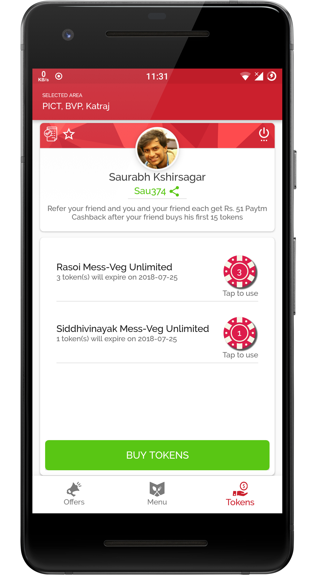

# Messed Up - Android Application

    
  <b>Here's how it looks like.</b>
   

## Table of contents
* [General info](#general-info)
* [Technologies](#technologies)
* [Screenshots](#screenshots)

## General info
 A commercial Android Application to allow multiple on-campus dining options to students.
 Served more than 600 students and and 1700+ orders.
	
## Technologies
Project is created with:
* Firebase Database
* MySQL
* PHP
* SQLite Database
* JAVA
* HTTP RequestManager

## Screenshots

   
  <b>Home Activity | Dining Menu Screen</b>
    

   
  <b>User Profile Activity</b>
    

   
  <b>Buy Meal Pass Activity</b>
    

   
  <b>Activity Screen after using Meal Pass</b>
    

   
  <b>Payment Success Activity</b>
    

   
  <b>Offer and Notifications Activity</b>
    

